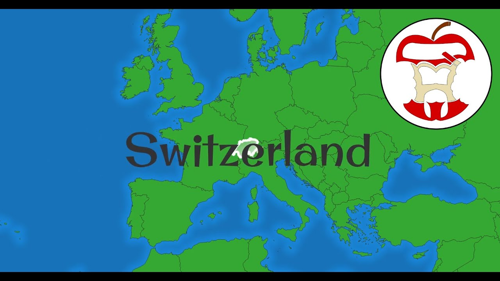

# QGIS Animation Workbench

Welcome to the QGIS Animation Workbench (QAW). QAW is a [QGIS Plugin](https://qgis.org) that will help you bring your maps to life! Let's start with a quick overview. Click on the image below to view a 14 minute walkthrough on YouTube.

About   | Status
--------|-------------
        | 
 |  
 | 
| 
 |
 |

## 📦 Packages

| Name                                     | Description                          |
| ---------------------------------------------------------------------------------------------------- | ------------------------------------ |
| [`Alpha Version 3`](https://github.com/timlinux/QGISAnimationWorkbench/archive/refs/tags/apha-3.zip) | Alpha Release (not production ready) |
| [`Alpha Version 2`](https://github.com/timlinux/QGISAnimationWorkbench/archive/refs/tags/apha-2.zip) | Alpha Release (not production ready) |
| [`Alpha Version 1`](https://github.com/timlinux/QGISAnimationWorkbench/archive/refs/tags/apha-1.zip) | Alpha Release (not production ready) |

## 📚 Documentation

You can find documentation for this plugin on our [GitHub Pages Site](https://timlinux.github.io/QGISAnimationWorkbench/) and the source for this documentations is managed in the [docs](docs) folder.

## 🐾 Examples

Let's show you some examples!

A simple spinning globe:

<https://user-images.githubusercontent.com/178003/156930974-e6d4e76e-bfb0-4ee2-a2c5-030eba1aad8a.mp4>

A street tour of Zaporizhzhia:

<https://user-images.githubusercontent.com/178003/156930785-d2cca084-e85d-4a67-8b6c-2dc090f08ac6.mp4>

Data above © OpenStreetMap Contributors

QGIS Developers:

<https://user-images.githubusercontent.com/178003/156931066-87ce89e4-f8d7-46d9-9d30-aeba097f6d98.mp4>

## 🌏 QGIS Support

Should work with and version of QGIS 3.x. If you have QGIS 3.26 or better you can benefit from the animated icon support (see @nyalldawson's most excellent patch [#48060](https://github.com/qgis/QGIS/pull/48060)).

For QGIS versions below 3.26, see the documentation for [QGIS Animation Workbench](https://timlinux.github.io/QGISAnimationWorkbench/library/snippets/)

## 🚀 Used By

- [Tell Us](https://example.com)

## 📜 License

This software is licensed under the [GPL v2](https://github.com/timlinux/QGISAnimationWorkbench/blob/master/LICENSE) © [timlinux](https://github.com/timlinux).

## 💛 Credits

- Tim Sutton
- Nyall Dawson
- Mathieu Pellerin
- Jeremy Prior
- Thiasha Vythilingam
  
