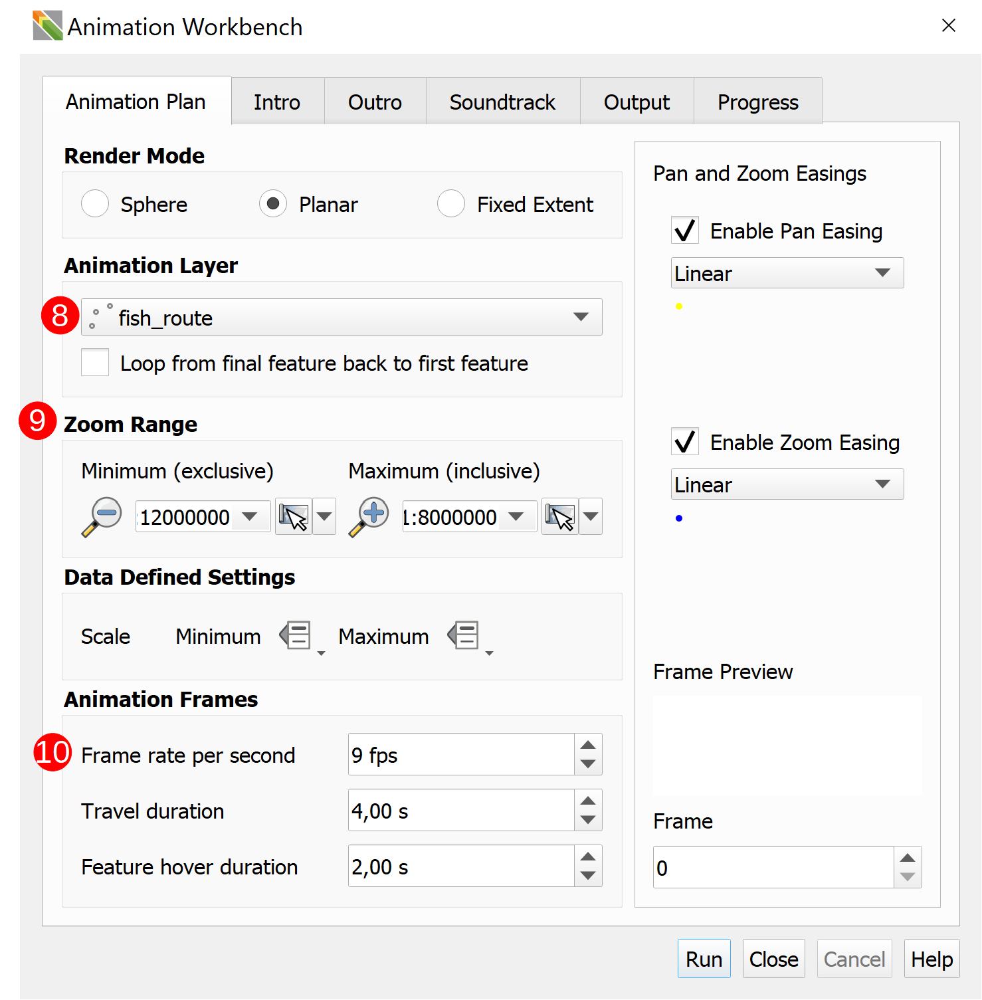
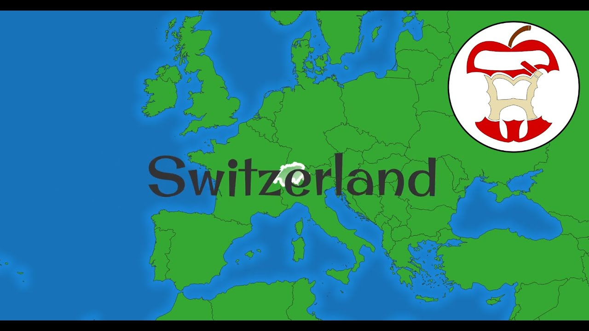

# QGIS Animation Workbench

**Bring your maps to life with stunning animations**


QGIS Animation Workbench (QAW) is a powerful [QGIS](https://qgis.org) plugin that transforms static maps into dynamic, cinematic animations. Create spinning globes, fly-through tours, animated symbols, and more - all without leaving QGIS. Whether you're producing educational content, storytelling with data, or showcasing geographic features, QAW provides an intuitive workbench for planning, previewing, and rendering professional map animations.



## Badges

| About | Status |
|-------|--------|
| [](https://github.com/timlinux/QGISAnimationWorkbench/releases/latest) | [](https://github.com/timlinux/QGISAnimationWorkbench/actions/workflows/ci.yml) |
| [](https://qgis.org/) | [](https://github.com/timlinux/QGISAnimationWorkbench/actions/workflows/BlackPythonCodeLinter.yml) |
| [](https://github.com/timlinux/QGISAnimationWorkbench/blob/master/LICENSE) | [](https://github.com/timlinux/QGISAnimationWorkbench/actions/workflows/BuildMKDocsAndPublishToGithubPages.yml) |
| [](https://www.python.org/) | [](https://github.com/timlinux/QGISAnimationWorkbench/actions/workflows/pages/pages-build-deployment) |
| [](https://github.com/timlinux/QGISAnimationWorkbench/issues) | [](https://github.com/timlinux/QGISAnimationWorkbench/pulls) |
| [](https://github.com/timlinux/QGISAnimationWorkbench/issues?q=is%3Aissue+is%3Aopen+label%3A%22help+wanted%22) | [](https://github.com/timlinux/QGISAnimationWorkbench/network/updates) |

## Video Overview

Click the image below to watch a 14-minute walkthrough on YouTube:

[](https://youtu.be/DkS6yvnuypc)

## Quickstart

1. **Install the plugin** from the QGIS Plugin Manager or download from [Releases](https://github.com/timlinux/QGISAnimationWorkbench/releases)
2. **Open a QGIS project** with your map layers configured
3. **Launch Animation Workbench** from the Plugins menu
4. **Configure your animation** - choose render mode (Sphere, Planar, or Fixed Extent), set frame rate and duration
5. **Preview and render** your animation to video

For detailed instructions, see the [Documentation](https://timlinux.github.io/QGISAnimationWorkbench/).

## Examples

**Spinning Globe:**

https://user-images.githubusercontent.com/178003/156930974-e6d4e76e-bfb0-4ee2-a2c5-030eba1aad8a.mp4

**Street Tour of Zaporizhzhia:**

https://user-images.githubusercontent.com/178003/156930785-d2cca084-e85d-4a67-8b6c-2dc090f08ac6.mp4

*Data above © OpenStreetMap Contributors*

**QGIS Developers Animation:**

https://user-images.githubusercontent.com/178003/156931066-87ce89e4-f8d7-46d9-9d30-aeba097f6d98.mp4

## QGIS Compatibility

- Works with QGIS 3.x
- QGIS 3.26+ enables animated icon support ([PR #48060](https://github.com/qgis/QGIS/pull/48060))
- For older versions, see the [snippets documentation](https://timlinux.github.io/QGISAnimationWorkbench/library/snippets/)

## Documentation

- [Full Documentation](https://timlinux.github.io/QGISAnimationWorkbench/) - User guides, tutorials, and reference
- [Quickstart Guide](https://timlinux.github.io/QGISAnimationWorkbench/user/quickstart/) - Get started in minutes
- [API Reference](https://timlinux.github.io/QGISAnimationWorkbench/developer/) - For plugin developers

## For Contributors

We welcome contributions! Here's how to get involved:

- [Report bugs or request features](https://github.com/timlinux/QGISAnimationWorkbench/issues)
- [Submit a Pull Request](https://github.com/timlinux/QGISAnimationWorkbench/pulls)
- [Development Setup](https://timlinux.github.io/QGISAnimationWorkbench/developer/)

## For Developers

```bash
# Clone the repository
git clone https://github.com/timlinux/QGISAnimationWorkbench.git
cd QGISAnimationWorkbench

# Enter the development environment
nix develop

# Build documentation
mkdocs serve
```

## License

This software is licensed under the [GPL v2](https://github.com/timlinux/QGISAnimationWorkbench/blob/master/LICENSE).

## Credits

- **Tim Sutton** - Lead developer
- **Nyall Dawson** - Core contributor
- **Mathieu Pellerin** - Contributor
- **Jeremy Prior** - Contributor
- **Thiasha Vythilingam** - Contributor

---

Made with :heart: by [Kartoza](https://kartoza.com) | [Donate](https://github.com/sponsors/timlinux) | [GitHub](https://github.com/timlinux/QGISAnimationWorkbench)
