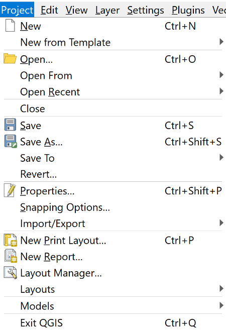
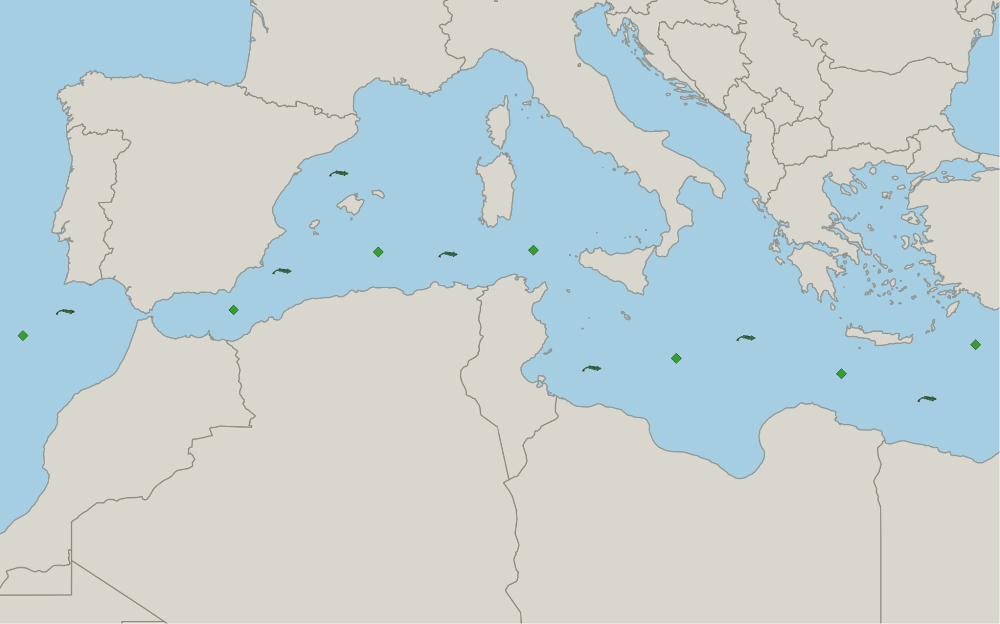
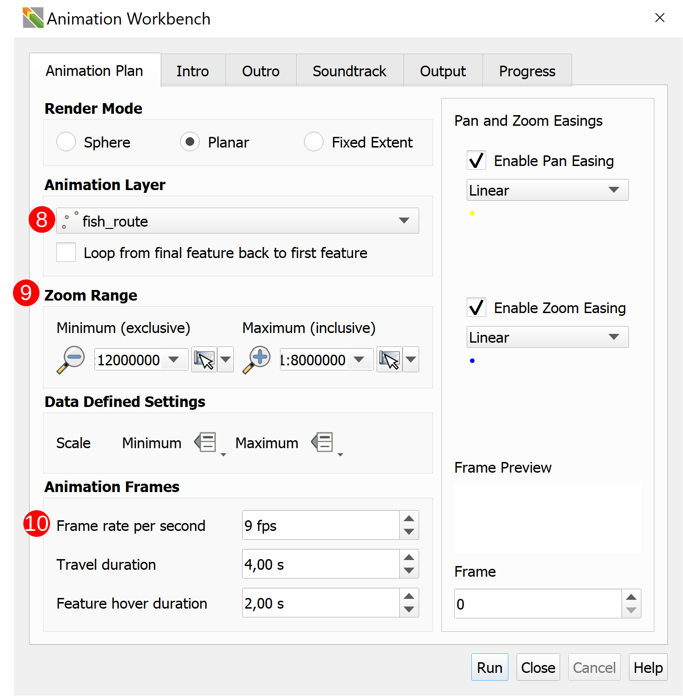
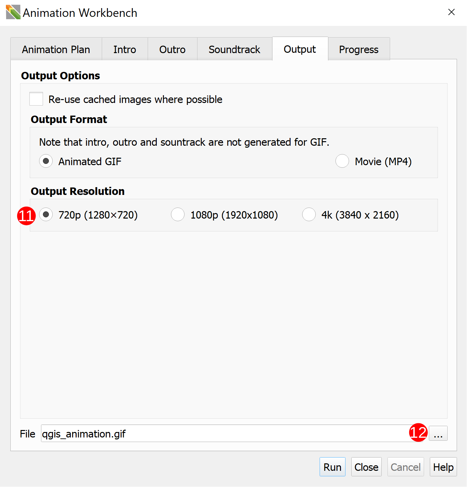

# How to set up a project to work with the animation plugin

1\. The first step for getting an output using the Workbench is to create a QGIS Project
&nbsp;<!--Adds blank space for formatting-->
Open QGIS and click on `Project` ➔ `New`



&nbsp;<!--Adds blank space for formatting-->

Next, add new layers to your project. You will want a few layers; one, or more, backing
layer(s) (vector layers or XYZ Tiles), a layer for the workbench to follow, and one,
or more, layer(s) of animated points. The example in this section only has one animated
layer.
&nbsp;<!--Adds blank space for formatting-->

To add a layer, go to `Layer` ➔ `Create Layer` and then select the type of layer you
want to add. The example adds a point layer to a GeoPackage to make the project more
portable.


Once you have added your layers you need to add features to the layers. This is done
by selecting a layer and then clicking `Toggle Editing` (**`1`**) ➔ `Add PointFeature` (**`2`**).
Then click around on your map to add as few, or as many, features as you need.


The example project has four layers: two point layers (**`3`**) and two backing layers (**`4`**).


> A simple way to add a vector base layer is to type "world" into the coordinate
textbox

Finally, style your layers to make your project look aesthetically pleasing. To
style your layers you must select the layer you want to style and then using the
Layer Styling toolbar, play around with the style of the layer until it suits you. A
good practice is to have your backing layers as more muted colours and your desired
features as more eye-catching colours.



&nbsp;<!--Adds blank space for formatting-->
You now have a QGIS Project.
&nbsp;<!--Adds blank space for formatting-->

2\. The next step is to choose which features you want to be animated.
&nbsp;<!--Adds blank space for formatting-->

Pick the layer (or layers) that you want to have animations. Then either find, or create,
the animation for the layer. Make sure you have all the correct attribution for any
animations you use. Below is an example of a simple fish animation split into its frames.
The frames are repeated to slow down the animation's playback speed.


&nbsp;<!--Adds blank space for formatting-->

- Now use the QGIS Expressions system with the variables introduced by the Animation
Workbench to define behaviours of your symbols during flight and hover modes of your
animation.
&nbsp;<!--Adds blank space for formatting-->
Select the layer you want to animate and open the Layer Styling toolbar.

> If you are using `QGIS 3.26` you can simply use the new animated point symbol,
or if you're using an older version of `QGIS 3.x` follow the instructions below.

The layer should contain a `Raster Image Marker`. Once you have selected the marker you
want to use click on the QGIS Expressions dropdown menu (**`5`**) and click on `Edit` (**`6`**).


&nbsp;<!--Adds blank space for formatting-->
> You can also make a marker move along a line relative to the frame of the animation.
Use the [Code Snippets Section](../library/snippets.md) for more in-depth help.

The example below works with the animation from earlier.


```sql
@project_home
|| 
'/fish/fish_00'
||
lpad(to_string( @frame_number % 32), 2, '0')
||
'.png'
```

3\. Configure your animation

After animating your markers it's time to configure your animation. Open the Animated
Workbench and begin choosing between the different modes and options.
&nbsp;<!--Adds blank space for formatting-->

Open the Workbench by clicking the `Animation Workbench` (**`7`**) icon in the Plugin Toolbar.


&nbsp;<!--Adds blank space for formatting-->

Configure the settings for your animation. The screenshot below is configured for
the example presented in this section. The Animation Layer is selected as `route` (**`8`**)
because that is the path that the output animation will fly along. The Zoom Range (**`9`**) was
selected from the Map Canvas Extent, and the Frame rate per second (fps) (**`10`**) was set to
match the number of frames of the animated markers so that they will play nicely in
the output. The other settings were selected as a personal choice.


&nbsp;<!--Adds blank space for formatting-->

Select the Output Resolution (**`11`**) and a location for your output by clicking on the
ellipsis (three dots) or by typing in the desired file path (**`12`**).


&nbsp;<!--Adds blank space for formatting-->

> Refer to the [Workbench User Interface](../docs/../manual/workbench_ui.md) section for more information about
what various settings and buttons accomplish.

4\. Render your animation!
&nbsp;<!--Adds blank space for formatting-->
Click `Run` and render your output. The output below is the output from the example.


