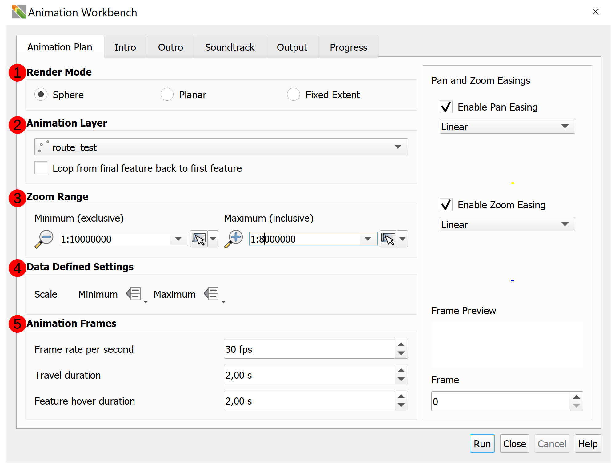
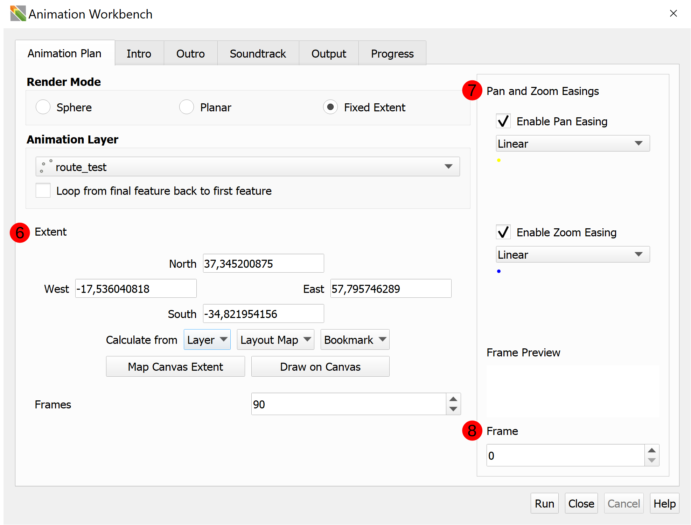
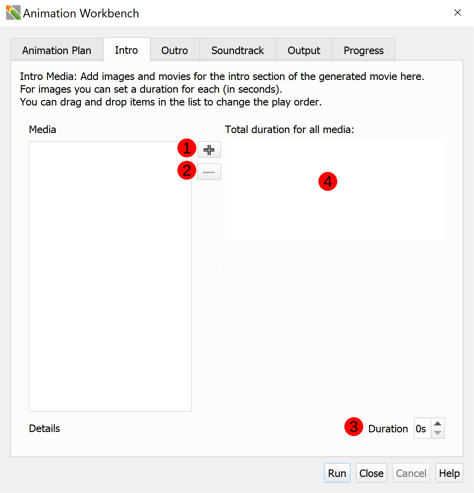
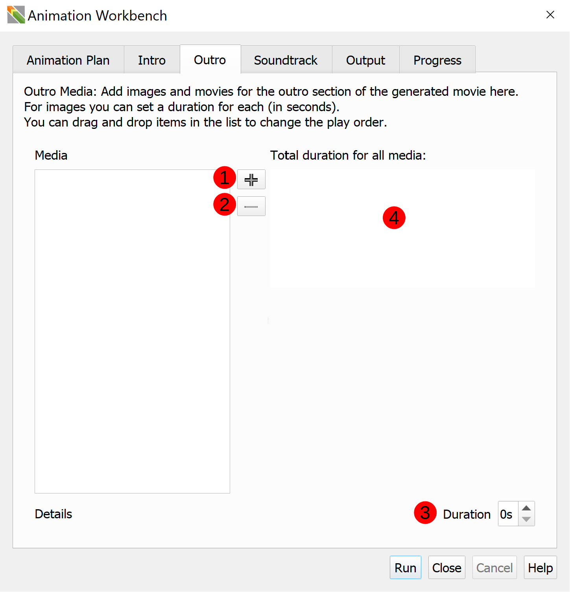
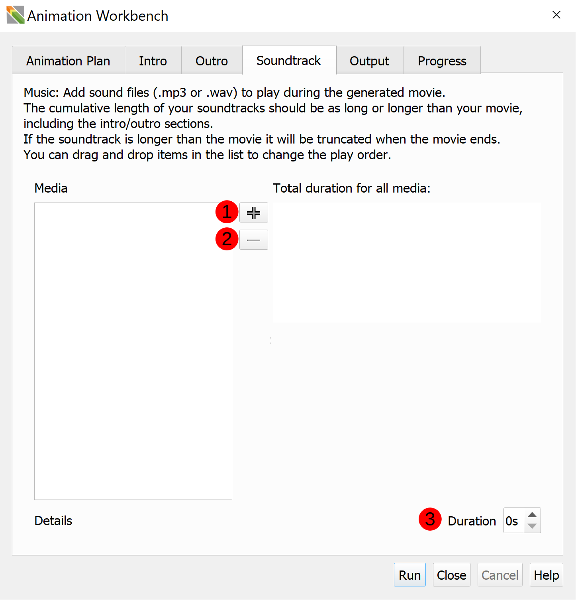
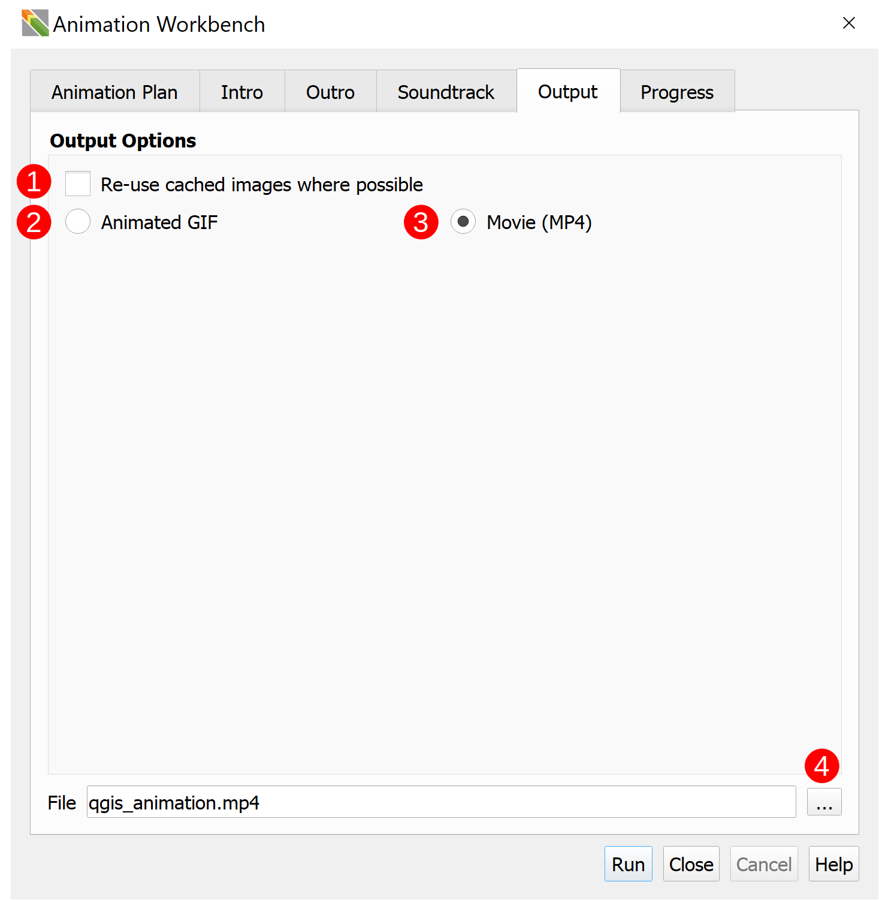
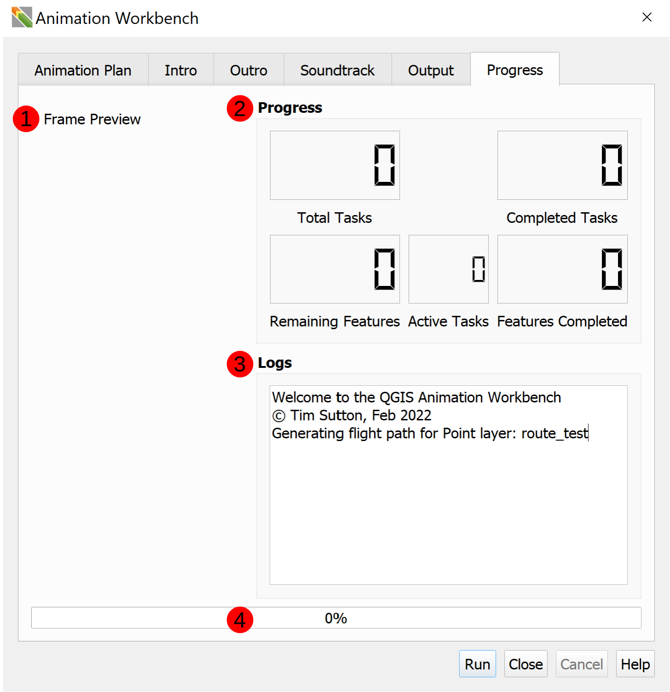

# The Workbench User Interface

## Animation Plan

- 1\. Render Modes: These determine the behaviour and type of animation
  - `Sphere`: the coordinate reference system (CRS) will be manipulated to create a spinning globe effect.
        Like Google Earth might do, but with your own data and cartography.
  - `Planar`: the coordinate reference system (CRS) will not be altered, but the camera will pan and zoom
        to each point. It lets you move from feature to feature on a flat map, pausing at each if you want to.
  - `Fixed extent`: The frame of reference stays the same and you can animate the symbology within that scene.

- 2\. Animation Layer:
  - `Dropdown menu`: Allows you to select which map layer you want the animation to follow.
  - `Loop from final feature back to first feature`: allows for a seamlessly looping output GIF or movie(MP4).

- 3\. Zoom Range: The scale range that the animation should move through.
  - Minimum (exclusive): the zenith (highest point) of the animation when it zooms out while travelling between
        points, i.e. the most "zoomed out".
  - Maximum (inclusive): the scale (zoom level) used when we arrive at each point, i.e. the most "zoomed in".

- 4\. Data defined settings
  - Scale
    - Minimum: User defined minimum scale
    - Maximum: User defined maximum scale

- 5\. Animation Frames
  - Frame rate per second (fps): When writing to video or gif, how many frames per second to use.
  - Travel Duration: This is the number of seconds that the animation will take during animation from one feature
         to the next.
  - Feature Hover duration: This is the number of seconds that the animation will hover over each feature.

- 6\. Extent:
  - Can be manually entered using North, East, South, and West coordinates as limits.
  - Can be calculated from a map layer, the layout map, or a bookmark.
  - Can be set to match the Map Canvas Extent
  - Can be set as a rectangular extent using the `Draw on Canvas` feature.

- 7\. Pan and Zoom Easings
  - What are Easings: Easings are transitions from one state to another along a smooth curve. A user can specify the
        shape of the curve used.
  - Pan Easings (XY): The pan easing will determine the motion characteristics of the camera on the X and Y axis as it
         flies across the scene (i.e. how it accelerates or decelerates between points)
  - Zoom Easing (Z): The pan easing will determine the motion characteristics of the camera on the Z axis as it flies
        across the scene (i.e. how the camera zooms in and out of the points)

- 8\. Frame previews: a preview of what each frame of the animation will look like. A user can decide which `Frame` to view.

## Intro Tab

Edit the intro section of the generated movie here.

- Media: List of the various images or movies selected for the intro section. You can drag and drop items in the list to change the play order.
  - 1\. Add Media (Plus sign): add image or movie
  - 2\. Remove Media (Minus sign): remove image or media
- 3\. Duration: For images you can set a duration for each image (in seconds).
- 4\. Preview Frame: Shows what the media will look like.
- Details: Provides details about where the media is stored on your computer.

## Outro Tab

Edit the outro section of the generated movie here.

- Media: List of the various images or movies selected for the outro section. You can drag and drop items in the list to change the play order.
  - 1\. Add Media (Plus sign): add image or movie
  - 2\. Remove Media (Minus sign): remove image or media
- 3\. Duration: For images you can set a duration for each image (in seconds).
- 4\. Preview Frame: Shows what the media will look like.
- Details: Provides details about where the media is stored on your computer.

## Soundtrack Tab

- Media: List of the various sound files (.mp3 or .wav) to play during the generate movie. You can drag and drop items in the list to change the play order.
  - 1\. Add Media (Plus sign): Add sound files (.mp3 or .wav) to play during the generated movie.
  - 2\. Remove Media (Minus sign): Remove sound files (.mp3 or .wav)
- 3\. Duration: The cumulative length of your soundtracks should be as long or longer than your movie, including the intro/outro sections. If the soundtrack is longer than the movie it will be truncated (shortened) when the movie ends.
- Details: Provides details about where the media is stored on your computer.

## Output

- Output Options: Select which output format you would like. Regardless the format chosen, a folder
of images will be created, one image per frame.
  - 1\. Re-use cached Images: Will not erase cached images on disk and will resume processing from last cached image.
  - 2\. Animated GIF: For this export to work, you need to have the ImageMagick 'convert'  application available on your system.
  - 3\. Movie (MP4): For the this option to work, you need to have the 'ffmpeg' application on your system.
  - 4\. File selection (ellipsis): lets a user select the location where the output will be stored.

## Progress

- 1\. Frame Preview: a preview of what each frame of the animation will look like. It changes automatically as the workbench runs.
- 2\. Progress: provides a detailed look at what is happening while the workbench runs.
  - Total Tasks: this number represents the total number of frames that will be generated by the workbench.
  - Completed Tasks: the number of tasks that have completed processing.
  - Remaining Features: the number of features from your animation layer that still need to be processed.
  - Active Tasks: the number of tasks (threads) currently being run by the workbench
  - Features Complete: the number of tasks that have been processed by the workbench.
- 3\. Logs: a detailed list of what steps the workbench is doing (a record of processing)
- 4\. Progress Bar: a visual representation of the workbench's progression as a percentage.

## Other Buttons

- `Run`: starts the process of getting an output from the workbench. It is greyed out until a user provides a destination for the output file.
- `Close`: closes the workbench.
- `Cancel`: ends the workbench processing at whatever point it has reached when the button is pressed.
- `Help`: opens a link to the Animation Workbench documentation.
