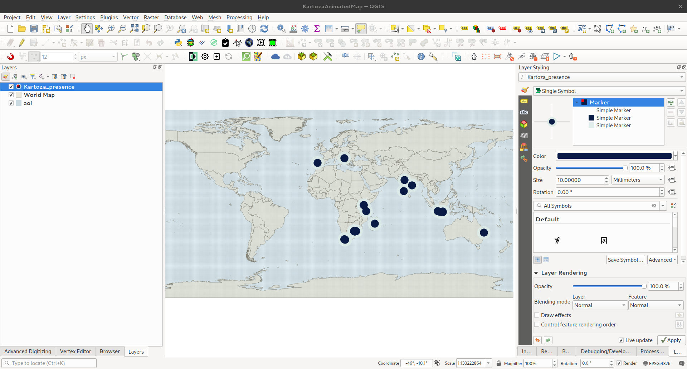
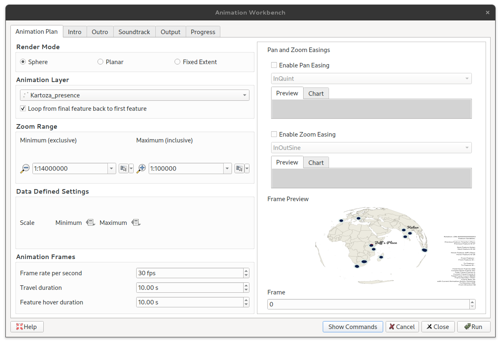

## Tutorial 1: Point Along A Line

This tutorial introduces the concept of moving a point along a line within your animated
map.

1\. Download and extract the **[Required Tutorial Zip Folder](https://github.com/timlinux/QGISAnimationWorkbench/blob/main/examples/tutorial_1.zip)**
&nbsp;<!--Blank Space-->

2\. Open the **tutorial_1.qgz** project file that is in the folder. When you first open it you
you see something like this:


&nbsp;<!--Blank Space-->

3\. Select the premade `line` layer (**`1`**), and click on the `Add Symbol Layer`
(*green plus symbol*) button (**`2`**) to it.


Change the new `Symbol Layer` (**`3`**) type to marker line and then style it (**`4`**) so that it is more visible.


4\. Change the `Symbol Layer's` settings so that the point is only on the `first vertex` (**`5`**) and
and not at equidistant intervals.

Change the offset along the line to be `Percentage` (**`6`**).


Click the `Dropdown Menu` (**`7`**) ➔`Edit...` (**`8`**) and then add the following code snippet


```sql
    -- Point Along Line Code Snippet
    (@current_hover_frame/@hover_frames) * 100
```


The snippet tells QGIS how far along the line (as a percentage of the line length) to
render the point in each frame.

5\. Open the Workbench and select `Fixed Extent` (**`9`**).

Click on `Map Canvas Extent` (**`10`**) and set the the `Frames` to 300 (**`11`**) (for a 10 second
output at 30 frames per second).


6\. Skip over the `Intro`, `Outro`, and `Soundtrack` tabs. In the `Output` tab, set the output
format (**`12`**) and resolution (**`13`**), and set the output location's path (**`14`**).


7\. Click `Run` and render your output.


After this tutorial you should have a better idea of how to make a point move along a line.
An expansion to this example would be to make the moving point a dynamically changing
marker (like the markers in tutorial 1). Go have fun!

## Tutorial 2: Basic Dynamically Changing Markers <!-- The Two-torial-->

This tutorial aims to show you the basics of creating, and animating, a static layer to use
with the Animation Workbench. There are three pre-made layers to allow the main focus of
the tutorial to be on the Animation Workbench and not on QGIS as a whole.

1\. Download and extract the **[Required Tutorial Zip Folder](https://github.com/timlinux/QGISAnimationWorkbench/blob/main/examples/tutorial_2.zip)**
&nbsp;<!--Blank Space-->

2\. Open the **tutorial_2.qgz** project file that is in the folder.
&nbsp;<!--Blank Space-->

3\. Set the CRS of your project to **WGS84/UTM zone 35S (EPSG: 32735)**.


&nbsp;<!--Blank Space-->

4\. In the `Browser`, expand the **tutorial_2.gpkg** and add the three pre-made layers
(VaalDam, SouthAfrica, and route) (**`A`**) to your project.


&nbsp;<!--Blank Space-->

5\. In the `Layers` Panel, arrange the layers in the following order: `route`, `VaalDam`,
`SouthAfrica`. Then right-click on the `VaalDam` layer and `Zoom to Layer(s)` (**`B`**)


Style the three layers to your preferred style.
&nbsp;<!--Blank Space-->

6\. Now create a new layer in the **tutorial_2.gpkg** by clicking `Layer`➔`Create Layer`➔
`New GeoPackage Layer...` (**`C`**).


&nbsp;<!--Blank Space-->

Click on the `Ellipsis` (**`D`**), navigate to and select the **tutorial_2.gpkg**, and
click `Save`. Change the *Table name* to **fish** (**`E`**), set the *Geometry type* as **Point** (**`F`**), and
change the *CRS* to match the **Project CRS** (**`G`**).


Click on `OK` and then click `Add New Layer` on the window that pops up.
&nbsp;<!--Blank Space-->

7\. Select the `fish` layer and then click on `Toggle Editing`➔`Add Point Feature` (**`H`**).


Add a few points wherever you feel they should go (Hint: This is a fish layer so adding
them above the dam layer would be best). Don't worry about naming the points, just add
them.


Save your changes by clicking on `Save Layer Edits` just next to the `Toggle Editing`
button. Then stop editing the layer.
&nbsp;<!--Blank Space-->

8\. Repeat steps **6\.** and **7\.** but change the Table name to **bird** and add the points over
the land areas.


&nbsp;<!--Blank Space-->

9\. Select the `fish` layer and then in the `Layer styling` toolbar (**`I`**) change the
`Symbol layer type` to `Raster Image Marker` (**`J`**).


Select the marker image by clicking the `Dropdown menu`➔`Select File...` (**`K`**)
and then choosing `fish`➔`fish_0000.png`.


Click `Open`
&nbsp;<!--Blank Space-->

10\. Change the marker's *Size Unit* to `Meters at Scale` (**`L`**)


and set the *Width* and *Height* to *1000*.
&nbsp;<!--Blank Space-->

11\. Repeat Steps 9\. and 10\. with the `bird` layer but instead choosing `bird`➔`bird_0000.png`
and setting the *Width* and *Height* to *3000*.

&nbsp;<!--Blank Space-->
>In `QGIS 3.26`, or later, the `Symbol layer type` can simply be selected as
`Animated Marker` and Step 12\. can be skipped.

12\. To animate the `fish` and `bird` layers using the `QGIS Expressions` system click the
`Dropdown Menu`➔`Edit...` (**`M`**).


For the `fish` layer use the following expression:


```sql
    @project_home
    || 
    '/fish/fish_00'
    ||
    lpad(to_string( @frame_number % 32), 2, '0')
    ||
    '.png'
```

And for the `bird` layer use:


```sql
    @project_home
    ||
    '/bird/bird_00'
    || 
    lpad(to_string(@frame_number % 9), 2, '0')
    || 
    '.png'
```

> Refer to the [What is the Workbench doing?](../manual/under_the_hood.md) section for an explanation
    about what the above code snippet is doing.

13\. Open the Animation Workbench (refer to the [Using the Animation Workbench](../start/using.md) section
if you are unsure how to open the Workbench).

In the `Animation Plan` tab set:

* the `Render Mode` to `Planar` (**`N`**),
* the `Animation Layer` to `route` (**`O`**) using the dropdown menu,
* the `Zoom Range` (**`P`**) to *1:270000* for the *Minimum* and *1:135000* for the *Maximum*,
* the `Frame rate per second` to *9 fps* (**`Q`**),
* the `Travel duration` to *4,00 s* (**`R`**),
* and the `Feature hover duration` to *2,00 s* (**`S`**)

Enable both the `Pan` and `Zoom` easings and set them to linear.


  
14\. Skip past the `Intro`, `Outro`, and `Soundtrack` tabs to the `Output` tab. Set the
`Output Format` as `Animated Gif` (**`T`**) and the `Output Resolution` to
`720p (1280x720)` (**`U`**). The `Output Resolution` can be set as any of the three
choices but was set at `720` for this tutorial for the sake of speed. Set the output
location to one you can find easily (**`V`**)


&nbsp;<!--Blank Space-->

15\. Click `Run` and watch what the Workbench is doing in the `Progress` tab. Once the
Workbench is finished running, you should end up with an output similar to this:


After this tutorial you should have a better understanding of how to create a point layer
in your project and then to change the `Single Symbol` markers into stationary animated
markers. A key focus is the idea that you can tell versions of `QGIS` before `3.26` to dynamically
change markers using short code snippets. Versions of `QGIS` post `3.26` allow a user to
simply use the `Animated Marker` feature without editing an expression.

## Tutorial 3: Flying Points

This tutorial aims to show you how add a flying point animation to points on your map using
built-in QGIS functionalities (The geometry generator line) and introduced variables from
the workbench.

1\. Download and extract the **[Required Tutorial Zip Folder](https://github.com/timlinux/QGISAnimationWorkbench/blob/main/examples/tutorial2.zip)**
&nbsp;<!--Blank Space-->

2\. Open the **tutorial_3.qgz** project file.
When you first open the project file you should be greeted with something like this:


&nbsp;<!--Blank Space-->

3\. Create a new point layer in a new geopackage by clicking `Layer`➔`Create Layer`➔
 `New GeoPackage Layer...`. Click on the `Ellipsis` (three dots) next to the *Database*
textbox and navigate to the folder that the **tutorial_3.qgz** file is located in. Type the *File*
*name* **"tutorial_3"** (**`1`**) and ensure the file will be saved as a `GeoPackage` (**`2`**) and click
`Save` (**`3`**).


&nbsp;<!--Blank Space-->

Change the *Table name* to **flying_points** (**`4`**), set the *Geometry type* as **Point** (**`5`**) and
change the *CRS* to match the **Project CRS** (**`6`**).


Click `OK` (**`7`**)
&nbsp;<!--Blank Space-->

4\. Click on `Toggle Editing`➔`Add Point Feature` (**`8`**).


&nbsp;<!--Blank Space-->

And randomly add points to your map. Depending on your computer's capabilites, you
can add more, or fewer, points than the example below.


&nbsp;<!--Blank Space-->

Save your Layer Edits and toggle off the Editing tool.
&nbsp;<!--Blank Space-->

5\. Style the points layer.

Select the `flying_points` (**`9`**) layer and in the `Layer Styling` toolbar click on the
`Add Symbol Layer` (*green plus symbol*) button (**`10`**).


&nbsp;<!--Blank Space-->

Select the top `Simple Marker` (**`11`**) and change its *Symbol layer type* to
`Geometry Generator` (**`12`**)


and then set the *Geometry type* to `LineString / MultiLineString` (**`13`**).


&nbsp;<!--Blank Space-->

Change the line's *Symbol layer type* to `Marker Line` (**`14`**).


&nbsp;<!--Blank Space-->

Add a second `Simple marker` to the marker line so that you end up with something like
this:


&nbsp;<!--Blank Space-->

Style the various `Simple Markers` to your preferred look.

&nbsp;<!--Blank Space-->

6\. Select the `Geometry Generator` symbol layer (**`15`**) and add this code to it:

```sql
    wave_randomized(
    make_line(
    $geometry, geometry(@hover_feature)), 
    100, 1000, 1000, 10000, 1)
```


&nbsp;<!--Blank Space-->

>More information about what changing the numbers will affect can be found in the
QGIS expressions editor.
&nbsp;<!--Blank Space-->

7\. A few options need to be changed in the `Marker Line` symbol layer (**`16`**): The *Marker*
*placement* needs to be set to `On first vertex` (**`17`**) and, the *Offset along line* needs to be
changed to `Percentage` (**`18`**). The click the `Dropdown menu` next to *Offset along line* and
select `Edit...` (**`19`**).


&nbsp;<!--Blank Space-->

In the `Expression String Builder` add the following code snippet:

```sql
    100 - to_int((@current_hover_frame / @hover_frames) * 100 )
```


&nbsp;<!--Blank Space-->

Click `OK`
&nbsp;<!--Blank Space-->

8\. Select the first `Simple Marker` symbol layer (**`20`**) in the `Marker Line` symbol layer. Scroll
down to *Offset* and click on the `Dropdown Menu`➔`Edit..` (**`21`**).


&nbsp;<!--Blank Space-->

In the `Expression String Builder` add the following code snippet:

```sql
    -- Taken from https://spicyyoghurt.com/tools/easing-functions
    --    t = Time - Amount of time that has passed since the beginning of the animation. Usually starts at 0 and is slowly increased using a game loop or other update function.
    --    b = Beginning value - The starting point of the animation. Usually it's a static value, you can start at 0 for example.
    --    c = Change in value - The amount of change needed to go from starting point to end point. It's also usually a static value.
    --    d = Duration - Amount of time the animation will take. Usually a static value aswell.
    -- Sinusoidal
    -- -c / 2 * (Math.cos(Math.PI * t / d) - 1) + b;

    -- Use with the animation in static mode
    if(@hover_feature_id != $id,
    array(
        (-@hover_frames / 2) * (cos( (pi() * @frame_number / @hover_frames ) - 1)) ,
        (-@hover_frames / 2) * (sin( (pi() * @frame_number / @hover_frames ) - 1)) 
        ),
        array (0,0))
```


&nbsp;<!--Blank Space-->

Click `OK`
&nbsp;<!--Blank Space-->

9\. Open the `Animation Workbench` (**`22`**)


&nbsp;<!--Blank Space-->

10\. Set up the `Animation Plan` with:

* the `Render Mode` to `Planar` (**`23`**),
* the `Animation Layer` to `flying_points` (**`24`**) using the dropdown menu,
* the `Zoom Range` (**`25`**) to *1:22000000* for the *Minimum* and *1:11000000* for the
    *Maximum*,
* the `Frame rate per second` to *9 fps* (**`26`**),
* the `Travel duration` to *2,00 s* (**`27`**),
* the `Feature hover duration` to *2,00 s* (**`28`**),
* and the `Zoom Easing` as *InCirc* (**`29`**)


&nbsp;<!--Blank Space-->

> With a decently specced computer you can up the fps and get the points to fly
faster in your output.
&nbsp;<!--Blank Space-->

11\. Add license-free media to the `Intro`, `Outro`, and `Soundtrack`.
>Make sure your `Soundtrack` is as long as, or longer than, your final animation will be
(including the `Intro`, `Animation`, and `Outro`).

&nbsp;<!--Blank Space-->

12\. Set the `Output Format` as `Movie (MP4)` (**`30`**) and the `Output Resolution` to
`1080 (1920x1080)` (**`31`**). The `Output Resolution` can be set as any of the three
choices but was set at `1080` for this tutorial for the sake of speed. Set the output
location (**`32`**) to one you can easily locate.


&nbsp;<!--Blank Space-->

13\. Click `Run` and get an output. The **GIF** below is the visual output of the tutorial if you
followed step-by-step and set the parameters to exactly what was stated.


&nbsp;<!--Blank Space-->

The link to a more complex output (with an `Intro`, an `Outro`, and a `Soundtrack`) can
be found [here](https://www.youtube.com/watch?v=yrvHjdVgnSg)

&nbsp;<!--Blank Space-->

After this tutorial you should have a better idea of how you can use a mixture of built-in
QGIS functionalites and the workbench's introduced variables to generate interesting outputs.

## Tutorial 4: Spinning Globe

Given a global point layer and countries layer like this:




You can create a nice spinning globe effect like this:


I set up the animation workbench like this:



For the above animated GIF, I compressed it using imagemagick like this:

```
convert globe.gif -coalesce -resize 700x525 -fuzz 2% +dither -layers Optimize +map globe_small.gif
```

This is a handy technique if you want to generate small file size animations.


For the points I made a red marker using a quarter circle that spins around the points like this:


The rotation field expression is this:

```
if (@id = @hover_feature_id, 
    0-((1440 * (@current_hover_frame/@hover_frames)) % 360),
    0)
```

This will spin around 4 times during the hover cycle.

For the ocean (AOI in the layers list), I generated a grid of 1 degree cells covering the earth. You need to do it as smaller polygons instead of one large polygon because QGIS will run into issues reprojecting a single polygon whose edges lie on the date line.

Here is how the final video came out:


<!--## Tutorial 4: Flying Point Swarm... Still need to finalize this tutorial-->
