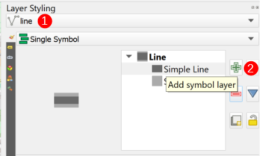
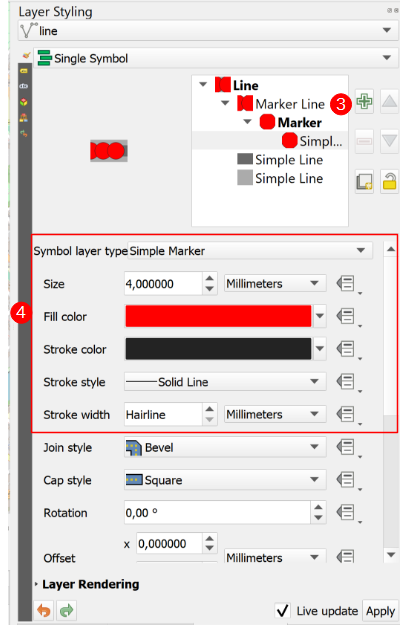

## Tutorial 1: Point Along A Line

This tutorial introduces the concept of moving a point along a line within your animated
map.

1\. Download and extract the **[Required Tutorial Zip Folder](https://github.com/timlinux/QGISAnimationWorkbench/blob/main/examples/tutorial_1.zip)**
&nbsp;<!--Blank Space-->

2\. Open the **tutorial_1.qgz** project file that is in the folder. When you first open it you
you see something like this:


&nbsp;<!--Blank Space-->

3\. Select the premade `line` layer (**`1`**), and click on the `Add Symbol Layer`
(*green plus symbol*) button (**`2`**) to it.



Change the new `Symbol Layer` (**`3`**) type to marker line and then style it (**`4`**) so that it is more visible.



4\. Change the `Symbol Layer's` settings so that the point is only on the `first vertex` (**`5`**) and
and not at equidistant intervals.

Change the offset along the line to be `Percentage` (**`6`**).


Click the `Dropdown Menu` (**`7`**) ➔`Edit...` (**`8`**) and then add the following code snippet


```sql
    -- Point Along Line Code Snippet
    (@current_hover_frame/@hover_frames) * 100
```


The snippet tells QGIS how far along the line (as a percentage of the line length) to
render the point in each frame.

5\. Open the Workbench and select `Fixed Extent` (**`9`**).

Click on `Map Canvas Extent` (**`10`**) and set the the `Frames` to 300 (**`11`**) (for a 10 second
output at 30 frames per second).


6\. Skip over the `Intro`, `Outro`, and `Soundtrack` tabs. In the `Output` tab, set the output
format (**`12`**) and resolution (**`13`**), and set the output location's path (**`14`**).


7\. Click `Run` and render your output.


After this tutorial you should have a better idea of how to make a point move along a line.
An expansion to this example would be to make the moving point a dynamically changing
marker (like the markers in tutorial 1). Go have fun!

