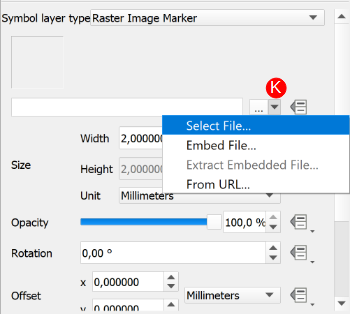

## Tutorial 2: Basic Dynamically Changing Markers <!-- The Two-torial-->

This tutorial aims to show you the basics of creating, and animating, a static layer to use
with the Animation Workbench. There are three pre-made layers to allow the main focus of
the tutorial to be on the Animation Workbench and not on QGIS as a whole.

1\. Download and extract the **[Required Tutorial Zip Folder](https://github.com/timlinux/QGISAnimationWorkbench/blob/main/examples/tutorial_2.zip)**
&nbsp;<!--Blank Space-->

2\. Open the **tutorial_2.qgz** project file that is in the folder.
&nbsp;<!--Blank Space-->

3\. Set the CRS of your project to **WGS84/UTM zone 35S (EPSG: 32735)**.


&nbsp;<!--Blank Space-->

4\. In the `Browser`, expand the **tutorial_2.gpkg** and add the three pre-made layers
(VaalDam, SouthAfrica, and route) (**`A`**) to your project.


&nbsp;<!--Blank Space-->

5\. In the `Layers` Panel, arrange the layers in the following order: `route`, `VaalDam`,
`SouthAfrica`. Then right-click on the `VaalDam` layer and `Zoom to Layer(s)` (**`B`**)


Style the three layers to your preferred style.
&nbsp;<!--Blank Space-->

6\. Now create a new layer in the **tutorial_2.gpkg** by clicking `Layer`➔`Create Layer`➔
`New GeoPackage Layer...` (**`C`**).


&nbsp;<!--Blank Space-->

Click on the `Ellipsis` (**`D`**), navigate to and select the **tutorial_2.gpkg**, and
click `Save`. Change the *Table name* to **fish** (**`E`**), set the *Geometry type* as **Point** (**`F`**), and
change the *CRS* to match the **Project CRS** (**`G`**).


Click on `OK` and then click `Add New Layer` on the window that pops up.
&nbsp;<!--Blank Space-->

7\. Select the `fish` layer and then click on `Toggle Editing`➔`Add Point Feature` (**`H`**).


Add a few points wherever you feel they should go (Hint: This is a fish layer so adding
them above the dam layer would be best). Don't worry about naming the points, just add
them.


Save your changes by clicking on `Save Layer Edits` just next to the `Toggle Editing`
button. Then stop editing the layer.
&nbsp;<!--Blank Space-->

8\. Repeat steps **6\.** and **7\.** but change the Table name to **bird** and add the points over
the land areas.


&nbsp;<!--Blank Space-->

9\. Select the `fish` layer and then in the `Layer styling` toolbar (**`I`**) change the
`Symbol layer type` to `Raster Image Marker` (**`J`**).


Select the marker image by clicking the `Dropdown menu`➔`Select File...` (**`K`**)
and then choosing `fish`➔`fish_0000.png`.



Click `Open`
&nbsp;<!--Blank Space-->

10\. Change the marker's *Size Unit* to `Meters at Scale` (**`L`**)


and set the *Width* and *Height* to *1000*.
&nbsp;<!--Blank Space-->

11\. Repeat Steps 9\. and 10\. with the `bird` layer but instead choosing `bird`➔`bird_0000.png`
and setting the *Width* and *Height* to *3000*.

&nbsp;<!--Blank Space-->
>In `QGIS 3.26`, or later, the `Symbol layer type` can simply be selected as
`Animated Marker` and Step 12\. can be skipped.

12\. To animate the `fish` and `bird` layers using the `QGIS Expressions` system click the
`Dropdown Menu`➔`Edit...` (**`M`**).


For the `fish` layer use the following expression:


```sql
    @project_home
    || 
    '/fish/fish_00'
    ||
    lpad(to_string( @frame_number % 32), 2, '0')
    ||
    '.png'
```

And for the `bird` layer use:


```sql
    @project_home
    ||
    '/bird/bird_00'
    || 
    lpad(to_string(@frame_number % 9), 2, '0')
    || 
    '.png'
```

> Refer to the [What is the Workbench doing?](../manual/under_the_hood.md) section for an explanation
    about what the above code snippet is doing.

13\. Open the Animation Workbench (refer to the [Using the Animation Workbench](../start/using.md) section
if you are unsure how to open the Workbench).

In the `Animation Plan` tab set:

* the `Render Mode` to `Planar` (**`N`**),
* the `Animation Layer` to `route` (**`O`**) using the dropdown menu,
* the `Zoom Range` (**`P`**) to *1:270000* for the *Minimum* and *1:135000* for the *Maximum*,
* the `Frame rate per second` to *9 fps* (**`Q`**),
* the `Travel duration` to *4,00 s* (**`R`**),
* and the `Feature hover duration` to *2,00 s* (**`S`**)

Enable both the `Pan` and `Zoom` easings and set them to linear.


  
14\. Skip past the `Intro`, `Outro`, and `Soundtrack` tabs to the `Output` tab. Set the
`Output Format` as `Animated Gif` (**`T`**) and the `Output Resolution` to
`720p (1280x720)` (**`U`**). The `Output Resolution` can be set as any of the three
choices but was set at `720` for this tutorial for the sake of speed. Set the output
location to one you can find easily (**`V`**)


&nbsp;<!--Blank Space-->

15\. Click `Run` and watch what the Workbench is doing in the `Progress` tab. Once the
Workbench is finished running, you should end up with an output similar to this:


After this tutorial you should have a better understanding of how to create a point layer
in your project and then to change the `Single Symbol` markers into stationary animated
markers. A key focus is the idea that you can tell versions of `QGIS` before `3.26` to dynamically
change markers using short code snippets. Versions of `QGIS` post `3.26` allow a user to
simply use the `Animated Marker` feature without editing an expression.

