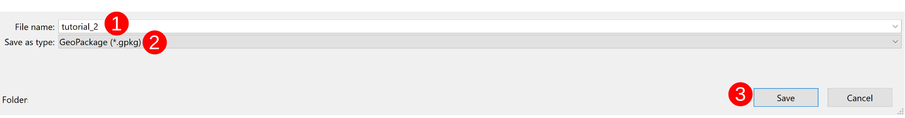

## Tutorial 3: Flying Points

This tutorial aims to show you how add a flying point animation to points on your map using
built-in QGIS functionalities (The geometry generator line) and introduced variables from
the workbench.

1\. Download and extract the **[Required Tutorial Zip Folder](https://github.com/timlinux/QGISAnimationWorkbench/blob/main/examples/tutorial2.zip)**
&nbsp;<!--Blank Space-->

2\. Open the **tutorial_3.qgz** project file.
When you first open the project file you should be greeted with something like this:


&nbsp;<!--Blank Space-->

3\. Create a new point layer in a new geopackage by clicking `Layer`➔`Create Layer`➔
 `New GeoPackage Layer...`. Click on the `Ellipsis` (three dots) next to the *Database*
textbox and navigate to the folder that the **tutorial_3.qgz** file is located in. Type the *File*
*name* **"tutorial_3"** (**`1`**) and ensure the file will be saved as a `GeoPackage` (**`2`**) and click
`Save` (**`3`**).


&nbsp;<!--Blank Space-->

Change the *Table name* to **flying_points** (**`4`**), set the *Geometry type* as **Point** (**`5`**) and
change the *CRS* to match the **Project CRS** (**`6`**).


Click `OK` (**`7`**)
&nbsp;<!--Blank Space-->

4\. Click on `Toggle Editing`➔`Add Point Feature` (**`8`**).


&nbsp;<!--Blank Space-->

And randomly add points to your map. Depending on your computer's capabilites, you
can add more, or fewer, points than the example below.


&nbsp;<!--Blank Space-->

Save your Layer Edits and toggle off the Editing tool.
&nbsp;<!--Blank Space-->

5\. Style the points layer.

Select the `flying_points` (**`9`**) layer and in the `Layer Styling` toolbar click on the
`Add Symbol Layer` (*green plus symbol*) button (**`10`**).


&nbsp;<!--Blank Space-->

Select the top `Simple Marker` (**`11`**) and change its *Symbol layer type* to
`Geometry Generator` (**`12`**)


and then set the *Geometry type* to `LineString / MultiLineString` (**`13`**).


&nbsp;<!--Blank Space-->

Change the line's *Symbol layer type* to `Marker Line` (**`14`**).


&nbsp;<!--Blank Space-->

Add a second `Simple marker` to the marker line so that you end up with something like
this:


&nbsp;<!--Blank Space-->

Style the various `Simple Markers` to your preferred look.

&nbsp;<!--Blank Space-->

6\. Select the `Geometry Generator` symbol layer (**`15`**) and add this code to it:

```sql
    wave_randomized(
    make_line(
    $geometry, geometry(@hover_feature)), 
    100, 1000, 1000, 10000, 1)
```


&nbsp;<!--Blank Space-->

>More information about what changing the numbers will affect can be found in the
QGIS expressions editor.
&nbsp;<!--Blank Space-->

7\. A few options need to be changed in the `Marker Line` symbol layer (**`16`**): The *Marker*
*placement* needs to be set to `On first vertex` (**`17`**) and, the *Offset along line* needs to be
changed to `Percentage` (**`18`**). The click the `Dropdown menu` next to *Offset along line* and
select `Edit...` (**`19`**).


&nbsp;<!--Blank Space-->

In the `Expression String Builder` add the following code snippet:

```sql
    100 - to_int((@current_hover_frame / @hover_frames) * 100 )
```


&nbsp;<!--Blank Space-->

Click `OK`
&nbsp;<!--Blank Space-->

8\. Select the first `Simple Marker` symbol layer (**`20`**) in the `Marker Line` symbol layer. Scroll
down to *Offset* and click on the `Dropdown Menu`➔`Edit..` (**`21`**).


&nbsp;<!--Blank Space-->

In the `Expression String Builder` add the following code snippet:

```sql
    -- Taken from https://spicyyoghurt.com/tools/easing-functions
    --    t = Time - Amount of time that has passed since the beginning of the animation. Usually starts at 0 and is slowly increased using a game loop or other update function.
    --    b = Beginning value - The starting point of the animation. Usually it's a static value, you can start at 0 for example.
    --    c = Change in value - The amount of change needed to go from starting point to end point. It's also usually a static value.
    --    d = Duration - Amount of time the animation will take. Usually a static value aswell.
    -- Sinusoidal
    -- -c / 2 * (Math.cos(Math.PI * t / d) - 1) + b;

    -- Use with the animation in static mode
    if(@hover_feature_id != $id,
    array(
        (-@hover_frames / 2) * (cos( (pi() * @frame_number / @hover_frames ) - 1)) ,
        (-@hover_frames / 2) * (sin( (pi() * @frame_number / @hover_frames ) - 1)) 
        ),
        array (0,0))
```


&nbsp;<!--Blank Space-->

Click `OK`
&nbsp;<!--Blank Space-->

9\. Open the `Animation Workbench` (**`22`**)


&nbsp;<!--Blank Space-->

10\. Set up the `Animation Plan` with:

* the `Render Mode` to `Planar` (**`23`**),
* the `Animation Layer` to `flying_points` (**`24`**) using the dropdown menu,
* the `Zoom Range` (**`25`**) to *1:22000000* for the *Minimum* and *1:11000000* for the
    *Maximum*,
* the `Frame rate per second` to *9 fps* (**`26`**),
* the `Travel duration` to *2,00 s* (**`27`**),
* the `Feature hover duration` to *2,00 s* (**`28`**),
* and the `Zoom Easing` as *InCirc* (**`29`**)


&nbsp;<!--Blank Space-->

> With a decently specced computer you can up the fps and get the points to fly
faster in your output.
&nbsp;<!--Blank Space-->

11\. Add license-free media to the `Intro`, `Outro`, and `Soundtrack`.
>Make sure your `Soundtrack` is as long as, or longer than, your final animation will be
(including the `Intro`, `Animation`, and `Outro`).

&nbsp;<!--Blank Space-->

12\. Set the `Output Format` as `Movie (MP4)` (**`30`**) and the `Output Resolution` to
`1080 (1920x1080)` (**`31`**). The `Output Resolution` can be set as any of the three
choices but was set at `1080` for this tutorial for the sake of speed. Set the output
location (**`32`**) to one you can easily locate.


&nbsp;<!--Blank Space-->

13\. Click `Run` and get an output. The **GIF** below is the visual output of the tutorial if you
followed step-by-step and set the parameters to exactly what was stated.


&nbsp;<!--Blank Space-->

The link to a more complex output (with an `Intro`, an `Outro`, and a `Soundtrack`) can
be found [here](https://www.youtube.com/watch?v=yrvHjdVgnSg)

&nbsp;<!--Blank Space-->

After this tutorial you should have a better idea of how you can use a mixture of built-in
QGIS functionalites and the workbench's introduced variables to generate interesting outputs.

