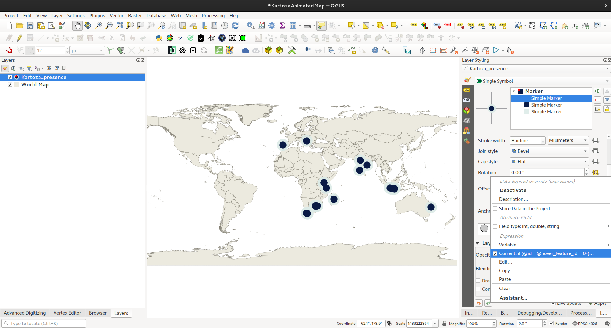

## Tutorial 4: Spinning Globe

Given a global point layer and countries layer like this:


You can create a nice spinning globe effect like this:


I set up the animation workbench like this:


For the above animated GIF, I compressed it using imagemagick like this:

```
convert globe.gif -coalesce -resize 700x525 -fuzz 2% +dither -layers Optimize +map globe_small.gif
```

This is a handy technique if you want to generate small file size animations.


For the points I made a red marker using a quarter circle that spins around the points like this:



The rotation field expression is this:

```
if (@id = @hover_feature_id, 
    0-((1440 * (@current_hover_frame/@hover_frames)) % 360),
    0)
```

This will spin around 4 times during the hover cycle.

For the ocean (AOI in the layers list), I generated a grid of 1 degree cells covering the earth. You need to do it as smaller polygons instead of one large polygon because QGIS will run into issues reprojecting a single polygon whose edges lie on the date line.

Here is how the final video came out:


<!--## Tutorial 4: Flying Point Swarm... Still need to finalize this tutorial-->
