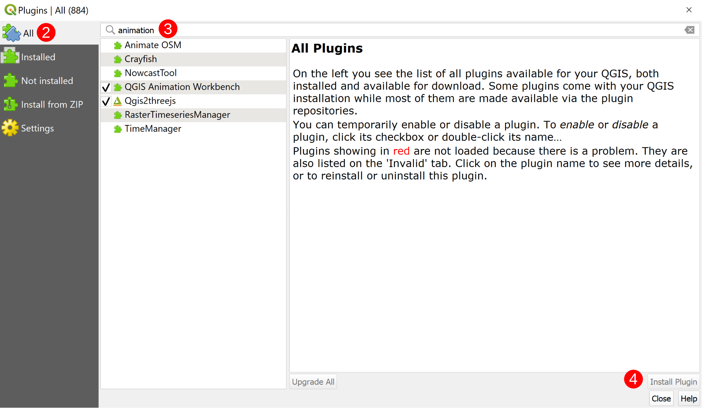
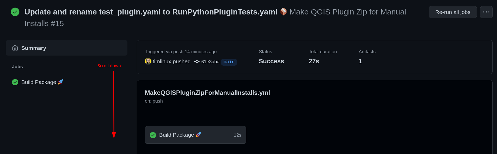

# Installing the QGIS Animation Workbench plugin

In this section we explain how to install the plugin.

## Install from plugin manager

To access the QGIS Plugin Manager you simply need to select
`Plugins` ➡ `Manage and Install Plugins...` (**`1`**) in the Menu Toolbar.


Once the QGIS Plugin Manager loads, you need to navigate to the `All` (**`2`**)
tab and type "animation" into the search bar (**`3`**). Select QGIS Animation
Workbench from the list of available plugins and then select `Install Plugin`
(**`4`**).



Once the Animation Workbench is installed, you can access it by clicking on the
`Animation Workbench` icon (**`5`**) in the Plugin Toolbar.


> Note if you are on Ubuntu, you may need to install the Qt5 multimedia
libraries.

```bash
sudo apt install PyQt5.QtMultimedia
```

## Manual install from GitHub (tagged release)

To install, visit the [Github
Repository](https://github.com/timlinux/QGISAnimationWorkbench), click on the
`Actions` tab, and click on the `Make QGIS Plugin Zip For Manual Installs`
workflow (the bottom one).


Click on the most recent workflow run (the top one).


Scroll down on the on the page.



And click on `animation_workbench` to download the most recent build of the plugin


Download the `animation_workbench.zip` file and open it in QGIS using the plugin
manager as described below.

1. Open QGIS
2. **Plugins ➡ Manage and install plugins ...**
3. Choose the **Install from zip** tab

4. Select the **animation_workbench.zip** download
5. Click the Install **Plugin button**.

> Note if you are on Ubuntu, you may need to install the Qt5 multimedia
libraries.

```bash
sudo apt install PyQt5.QtMultimedia
```
