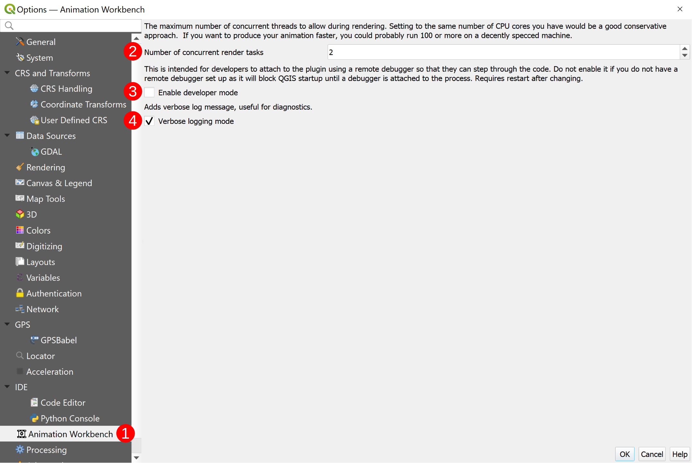

# Initial Configuration

There is nothing really to configure! We do provide a few options in the
configuration dialog, but most users should not need to change them.

You can access the QGIS Animation Workbench plugin options by opening the standard
QGIS Setting dialog and clicking on the animation workbench tab.

> Settings ➔ Options

- **Animation Workbench plugin Options (`1`)**

Currently there are just three configuration options:

- **Number of concurrent render tasks (`2`):** This is the number of concurrent tasks
that will be used to render animations. The default is 10.
- **Enable developer mode (`3`):** This is a developer option that enables the developers
to see an icon in the toolbar which will start the debug remote server.
- **Verbose logging mode (`4`):** This will add extra messages in the logging pane to
help you understand what is going on during the rendering process.
