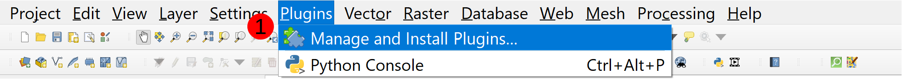
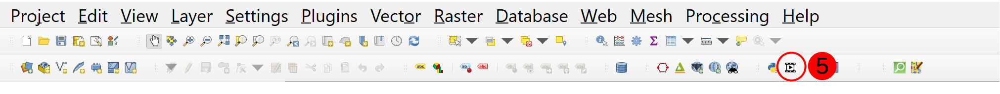

# Installing the QGIS Animation Workbench plugin

We have not yet published the plugin in the QGIS Plugin Repository, but when we
do you will be able to access it simply by clicking on the "QGIS Animation Workbench"
option in the QGIS Plugin Manager.

To access the QGIS Plugin Manager you simply need to select
`Plugins` -> `Manage and Install Plugins...` (**`1`**) in the Menu Toolbar.



Once the QGIS Plugin Manager loads, you need to navigate to the `All` (**`2`**) tab and
type "animation" into the search bar (**`3`**). Select QGIS Animation Workbench from the list
of available plugins and then select `Install Plugin` (**`4`**).


Once the Animation Workbench is installed, you can access it by clicking on the
`Animation Workbench` icon (**`5`**) in the Plugin Toolbar.



> Note if you are on Ubuntu, you may need to install the Qt5 multimedia libraries.

```bash
sudo apt install PyQt5.QtMultimedia
```
