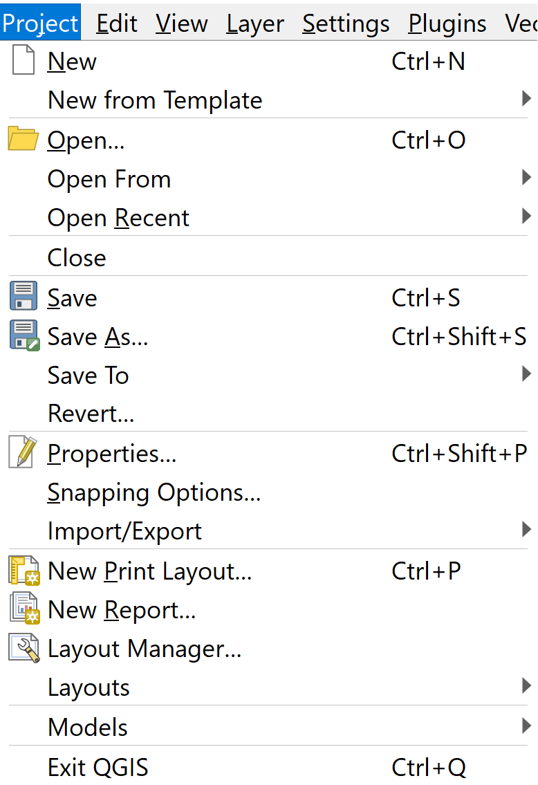
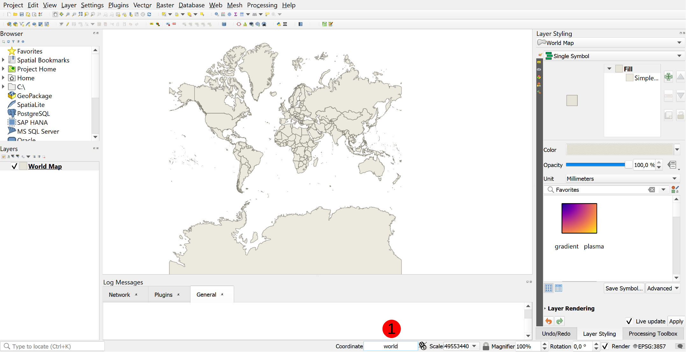
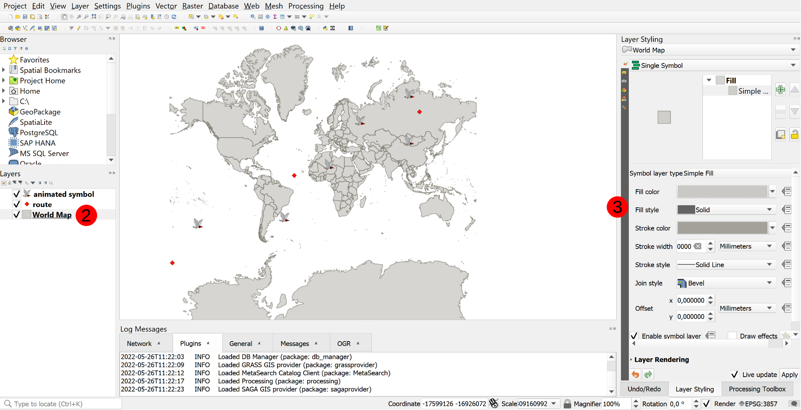
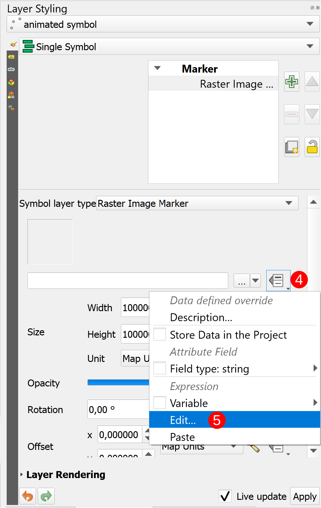
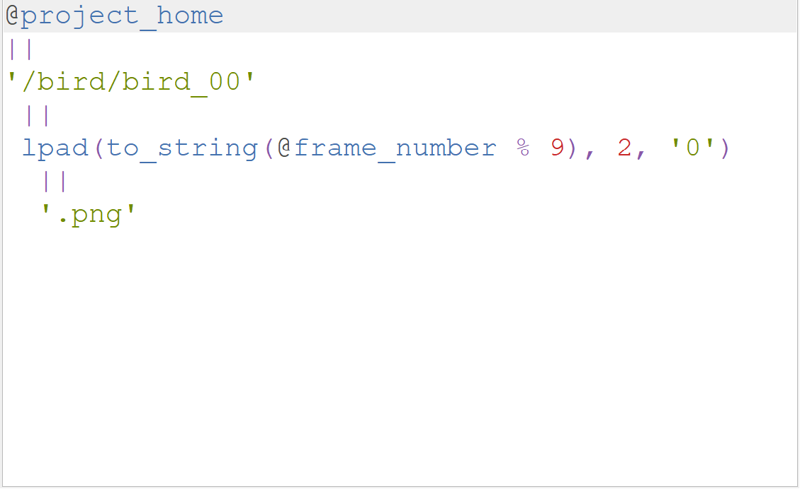
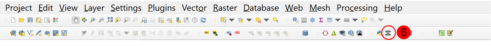
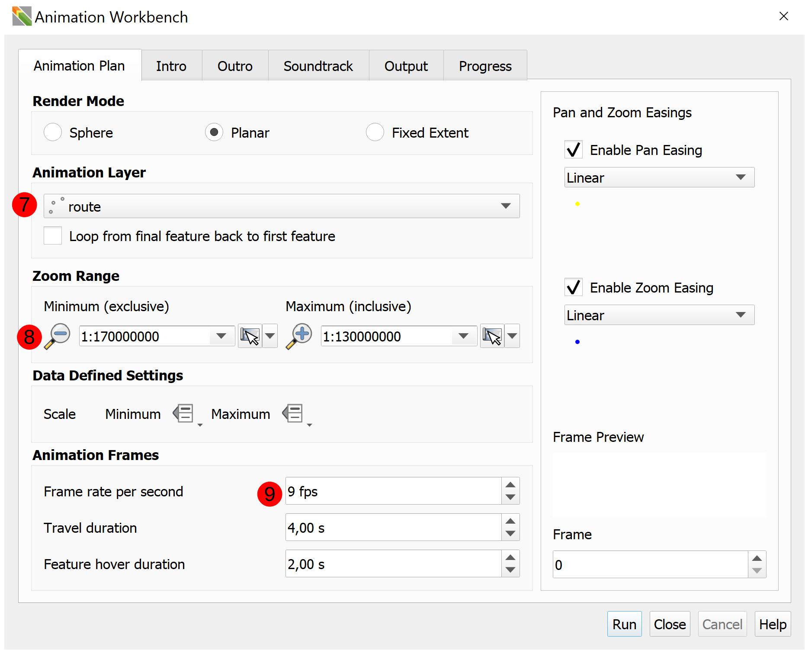
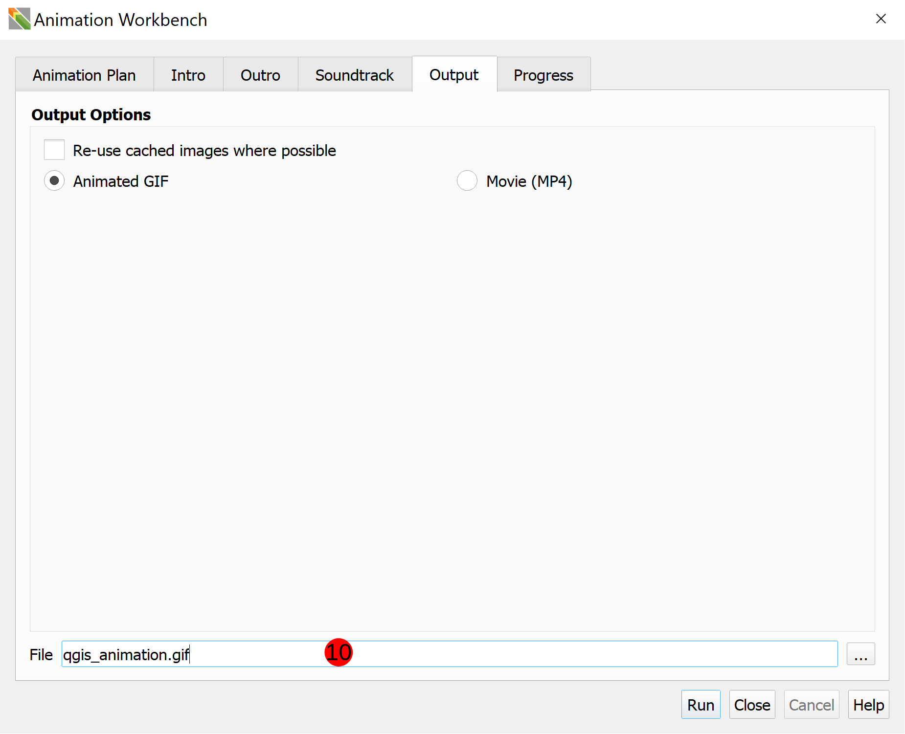

# Using the Animation Workbench

In this section, we describe the general workflow for using the Animation Workbench.

## Process Overview

1. Create a QGIS project!
2. Identify features that will be animated.
3. Use the QGIS Expressions system with the variables introduced by the Animation
   Workbench to define behaviours of your symbols during flight and hover modes of your
   animation.
4. Open the Animation Workbench and configure your animation, choosing between the
   different modes and options.
5. Render your animation!

## More in Depth Process

1. Create a QGIS Project
   &nbsp;<!--Adds blank space for formatting-->
   Open QGIS and click on `Project` -> `New`

   

   &nbsp;<!--Adds blank space for formatting-->

   Add new layers to your project

   

   > Note: A simple way to add a base layer is to type **`1`** "world" into the coordinate
   textbox

   Style the layers you've added to make your project look a bit better. **`2`** Select the
   layer you want to style and in the **`3`** Layer Styling toolbar, style the layer to
   look appealing to you.

   

   &nbsp;<!--Adds blank space for formatting-->

2. Identify features that will be animated.
   &nbsp;<!--Adds blank space for formatting-->

   Pick the layer (or layers) that you want to animate. Then either find or create the
   animation for the layer. Make sure you have all the correct attribution for any
   animations you use. Below is an example of an animation split into its frames.

   

3. Use the QGIS Expressions system with the variables introduced by the Animation
   Workbench to define behaviours of your symbols during flight and hover modes of your
   animation.
   &nbsp;<!--Adds blank space for formatting-->

   Select the layer you want to animate and open the Layer Styling toolbar.

   > Note: If you are using `QGIS 3.26` you can simply use the new animated point symbol,
   or if you're using an older version of `QGIS` follow the instructions below.

   The layer should be a `Raster Image Marker`. Once you have selected the image you
   want to use click on the **`4`** QGIS Expressions dropdown menu and click on **`5`** `Edit`.

   

   &nbsp;<!--Adds blank space for formatting-->
   Use the [Code Snippets Section](../library/snippets.md) for more in depth help. The
   example below works with the bird animation from earlier

   
   &nbsp;<!--Adds blank space for formatting-->

4. Open the Animation Workbench and configure your animation, choosing between the
   different modes and options.
   &nbsp;<!--Adds blank space for formatting-->

   Open the Workbench by clicking the **`6`** `Animation Workbench` icon in the Plugin Toolbar.

   
   &nbsp;<!--Adds blank space for formatting-->

   Configure the settings for your animation. The screenshot below is configured for
   the example presented in this section. The Animation Layer is selected as **`7`** route
   because that is the path the animation will fly along, the **`8`** Zoom Range was selected
   from the Map Canvas Extent, and **`9`** the Frame rate per second was set to 9 to match
   the bird animation.

   
   &nbsp;<!--Adds blank space for formatting-->

   **`10`** Select a location for your output.

   
   &nbsp;<!--Adds blank space for formatting-->

   > Note:  Refer to the [Workbench User Interface](../docs/../manual/workbench_ui.md) Section for more information about
   what various settings and buttons accomplish.

5. Render your animation!
   &nbsp;<!--Adds blank space for formatting-->
   Click `Run` and render your output. The output below is the output from the example.

   
