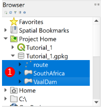
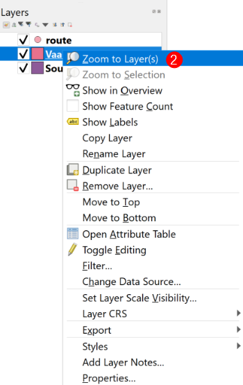
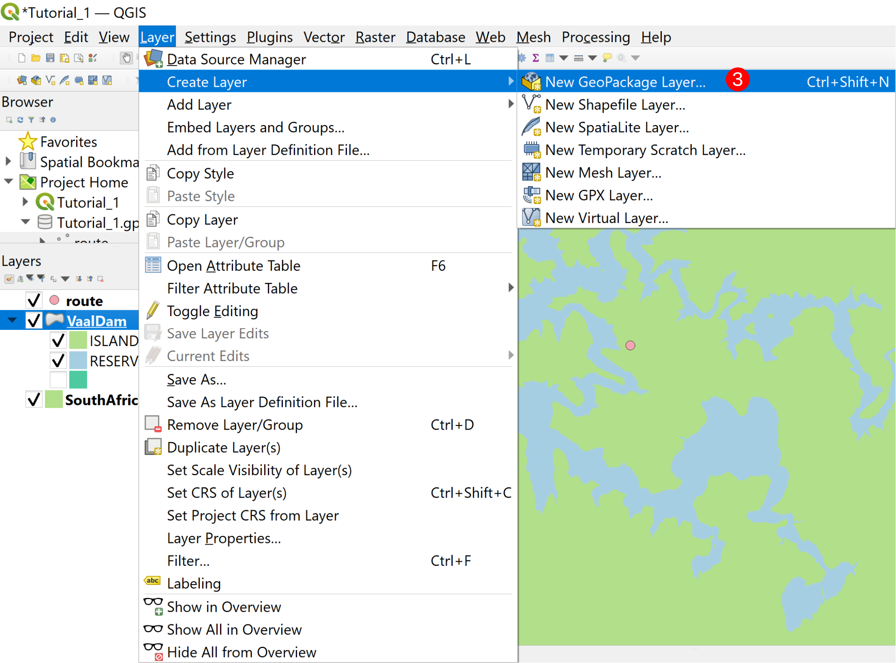
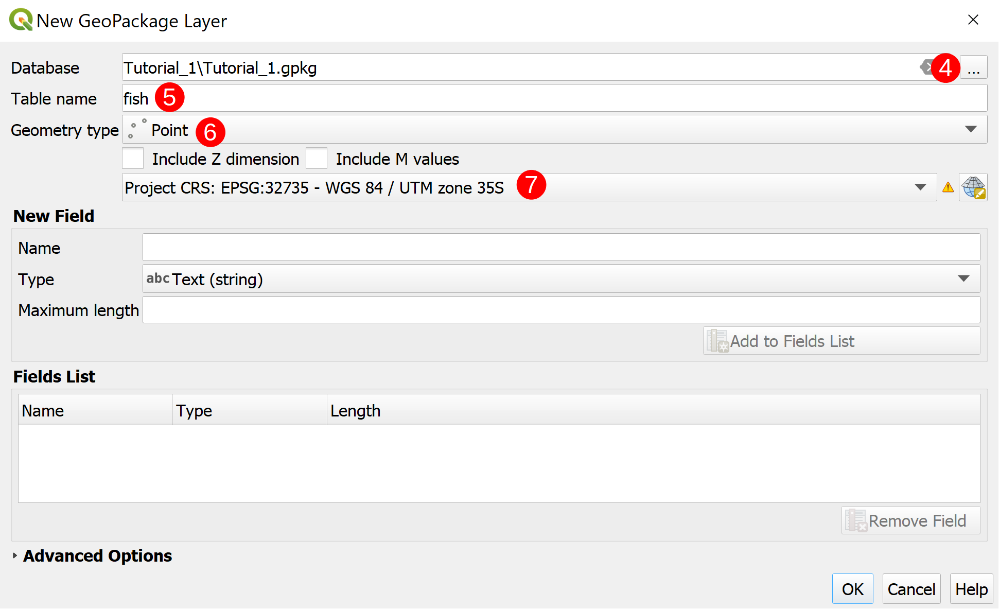
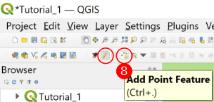
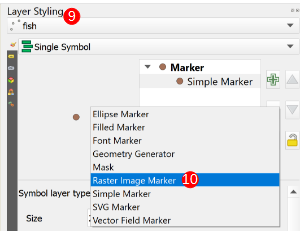
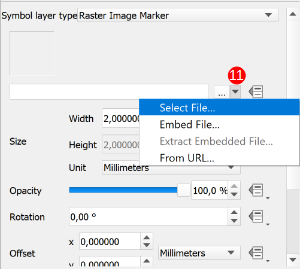
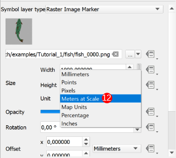
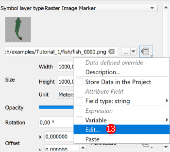
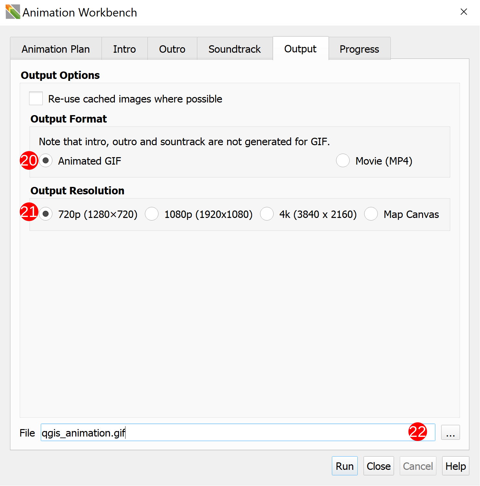

# Tutorial 1: The Basics

1. Download and extract the **[Required Tutorial Zip Folder](../../examples/Tutorial_1.zip)**
    &nbsp;<!--Blank Space-->

2. Open the **Tutorial_1.qgz** project file that is in the folder.
    &nbsp;<!--Blank Space-->

3. Set the CRS of your project to **WGS84/UTM zone 35S (EPSG: 32735)**.

    
    &nbsp;<!--Blank Space-->

4. In the `Browser`, expand the **tutorial_1.gpkg** and add the three pre-made layers
    (VaalDam, SouthAfrica, and route) (**`1`**) to your project.

    
    &nbsp;<!--Blank Space-->

5. In the `Layers` Panel, arrange the layers in the following order: `route`, `VaalDam`,
    `SouthAfrica`. Then right-click on the `VaalDam` layer and `Zoom to Layer(s)` (**`2`**)

    

    Style the three layers to your preferred style.
    &nbsp;<!--Blank Space-->

6. Now create a new layer in the **tutorial_1.gpkg** by clicking `Layer`➔`Create Layer`➔
    `New Geopackage Layer...` (**`3`**).

    

    Click on the `Ellipsis` (**`4`**), navigate to and select the **tutorial_1.gpkg**, and
    click `Save`

    Change the table name to **fish** (**`5`**), set the geometry type as **Point** (**`6`**), and change
    the CRS to match the **Project CRS** (**`7`**).

    

    Click on `OK` and then click `Add New Layer` on the window that pops up.
    &nbsp;<!--Blank Space-->

7. Select the `fish` layer and then click on `Toggle Editing`➔`Add Point Feature` (**`8`**).

   

   Add a few points wherever you feel they should go (Hint: This is a fish layer so adding
   them above the dam layer would be best). Don't worry about naming the points, just add
   them.

   

   Save your changes by clicking on `Save Layer Edits` just next to the `Toggle Editing`
   button. Then stop editing the layer.
   &nbsp;<!--Blank Space-->

8. Repeat steps 6\. and 7\. but change the table name to **bird** and add the points over
    the land areas.

    
    &nbsp;<!--Blank Space-->

9. Select the `fish` layer and then in the `Layer styling` toolbar (**`9`**) change the
    `Symbol layer type` to `Raster Image Marker` (**`10`**).

    

    Select the marker image by clicking the `Dropdown menu`➔`Select File...` (**`11`**)
    and then choosing `fish`➔`fish_0000.png`.

    

    Click `Open`
    &nbsp;<!--Blank Space-->

10. Change the marker's **Size Unit** to `Meters at Scale` (**`12`**)

    

    and set the *Width* and *Height* to *1000*.
    &nbsp;<!--Blank Space-->

11. Repeat steps 9\. and 10\. with the `bird` layer but instead choosing `bird`➔`bird_0000.png`
    and setting the *Width* and *Height* to *3000*.

    &nbsp;<!--Blank Space-->
    >Note: in `QGIS 3.26`, or later, the `Symbol layer type` can simply be selected as
    `Animated Marker` and step 12\. can be skipped.

12. To animate the `fish` and `bird` layers using the `QGIS Expressions` system click the
    `Dropdown Menu`➔`Edit...` (**`13`**).

    

    For the `fish` layer use the following expression:

    

    And for the `bird` layer use:

    
    &nbsp;<!--Blank Space-->

13. Open the Animation Workbench (refer to the [Using the Animation Workbench](../start/using.md) section
    if you are unsure how to open the Workbench).

    In the `Animation Plan` tab set:
    - the `Render Mode` to `Planar` (**`14`**),
    - the `Animation Layer` to `route` (**`15`**) using the dropdown menu,
    - the `Zoom Range` (**`16`**) to *1:270000* for the *Minimum* and *1:135000* for the *Maximum*,
    - the `Frame rate per second` to *9 fps* (**`17`**),
    - the `Travel duration` to *4,00 s* (**`18`**),
    - and the `Feature hover duration` to *2,00 s* (**`19`**)

    Enable both the `Pan` and `Zoom` easings and set them to linear.

    
    &nbsp;<!--Blank Space-->

14. Skip past the `Intro`, `Outro`, and `Soundtrack` tabs to the `Output` tab. Set the
    `Output Format` as `Animated Gif` (**`20`**) and the `Output Resolution` to
    `720p (1280x720)` (**`21`**). The `Output Resolution` can be set as any of the three
    choices but was set at `720` for this tutorial for the sake of speed. Set the output
    location to one you can find easily (**`22`**)

    
    &nbsp;<!--Blank Space-->

15. Click `Run` and watch what the Workbench is doing in the `Progress` tab. Once the
    Workbench is finished running, you should end up with an output similar to this:

    
